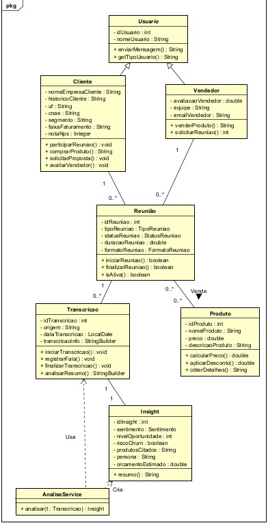

# Domain Driven Design - Java | FIAP

## ATLAS COMMUNICATION

## Objetivo da Solução

O sistema tem como objetivo simular um ambiente corporativo de reuniões comerciais entre vendedores e clientes, permitindo o gerenciamento de reuniões, transcrições, produtos e negociações comerciais de forma orientada a objetos utilizando Java.

---

# Equipe

* Deivid Ruan — RM566356
* Eduardo Bassan — RM561474
* Henry Andrade — RM562622
* João Victor Abe — RM561446
* Mariana S. do Egito Moreira — RM562544

---

# Descrição do Projeto

O projeto tem como objetivo representar um **sistema de gerenciamento de reuniões comerciais**, inspirado no contexto da empresa TOTVS, que realiza diariamente milhares de reuniões de vendas entre clientes e vendedores.

A proposta busca simular, de forma estruturada, o funcionamento desse processo comercial, permitindo a modelagem das principais entidades envolvidas em uma negociação corporativa.

O sistema foi desenvolvido com foco na organização e análise das interações realizadas durante reuniões de vendas, possibilitando registrar informações importantes relacionadas aos usuários, produtos apresentados e transcrições geradas ao longo da conversa. Dessa forma, o projeto contribui para uma melhor compreensão do fluxo de comunicação entre cliente e vendedor, além de facilitar futuras análises estratégicas e comerciais.

A modelagem foi construída utilizando os princípios da orientação a objetos e os padrões da UML, incluindo encapsulamento, relacionamentos, herança e multiplicidade entre classes. A classe `Usuario` foi criada como classe base abstrata do sistema, permitindo que as classes `Cliente` e `Vendedor` herdem atributos em comum, como identificação e nome do usuário, e implementem o método polimórfico `getTipoUsuario()`. Essa abordagem reduz redundâncias e melhora a organização estrutural do projeto.

A classe `Reuniao` representa o elemento central da aplicação, sendo responsável por conectar as demais classes do sistema. Por meio dela é possível relacionar clientes, vendedores, produtos e transcrições, tornando a reunião o principal ponto de interação entre os componentes do projeto.

A classe `Produto` foi desenvolvida para representar os itens ou serviços oferecidos durante a reunião, contendo informações como nome, preço e descrição. Já a classe `Transcricao` é responsável por armazenar e processar os dados gerados durante a conversa. A partir dela, a classe `Insight` (gerada pelo `AnaliseService`) extrai e registra informações relevantes da reunião.

Por fim, o projeto busca demonstrar como a modelagem UML pode ser utilizada para representar de forma organizada e profissional um sistema empresarial, permitindo melhor visualização das relações entre classes e maior compreensão das responsabilidades de cada componente dentro da aplicação.

---

# Diagrama UML



🔗 [Lucidchart — Diagrama UML](https://lucid.app/lucidchart/ae0810ed-76dd-45c9-b330-3fbf43514e5a/edit?viewport_loc=-1449%2C-670%2C1652%2C803%2C0_0&invitationId=inv_d353e8b3-55ca-4065-ba82-d4c47cb69daa)

---

# Modelo Lógico


---

# Classes, Atributos e Métodos

## Usuario *(abstrata)*

### Atributos

* `idUsuario`
* `nomeUsuario`

### Métodos

* `enviarMensagem()`
* `getTipoUsuario()` *(abstrato)*

---

## Cliente

### Atributos

* `nomeEmpresaCliente`
* `historicoCliente`
* `uf`
* `cnae`
* `segmento`
* `faixaFaturamento`
* `notaNps`

### Métodos

* `participarReuniao()`
* `comprarProduto()`
* `solicitarProposta()`
* `avaliarVendedor()`

---

## Vendedor

### Atributos

* `avaliacaoVendedor`
* `equipe`
* `emailVendedor`

### Métodos

* `venderProduto()`
* `solicitarReuniao()`

---

## Reuniao

### Atributos

* `idReuniao`
* `tipoReuniao`
* `statusReuniao`
* `duracaoReuniao`
* `formatoReuniao`

### Métodos

* `iniciarReuniao()`
* `finalizarReuniao()`
* `isAtiva()`

---

## Transcricao

### Atributos

* `idTranscricao`
* `origem`
* `dataTranscricao`
* `transcricaoInfo`

### Métodos

* `iniciarTranscricao()`
* `registrarFala()`
* `finalizarTranscricao()`
* `analisarResumo()`

---

## Produto

### Atributos

* `idProduto`
* `nomeProduto`
* `preco`
* `descricaoProduto`

### Métodos

* `calcularPreco()`
* `aplicarDesconto()`
* `obterDetalhes()`

---

## Insight *(diferencial)*

### Atributos

* `idInsight`
* `sentimento`
* `nivelOportunidade`
* `riscoChurn`
* `produtosCitados`
* `persona`
* `orcamentoEstimado`

### Métodos

* `resumo()`

---

# Diferenciais do Projeto

* **Enriquecimento com dados reais** — a classe `Cliente` foi enriquecida com atributos da base de transcrições (UF, CNAE, segmento, faixa de faturamento e NPS).
* **Análise da reunião** — a classe `Insight` e o serviço `AnaliseService` processam o texto da transcrição e registram informações relevantes: oportunidades identificadas, risco de churn, produtos TOTVS mencionados, persona, orçamento e sentimento.
* **Arquitetura em camadas** — separação em pacotes `model`, `service`, `repository` e `application`, seguindo boas práticas de Domain Driven Design.
* **Tipos enumerados e integridade** — enums (`StatusReuniao`, `TipoReuniao`, `FormatoReuniao`, `Sentimento`) e validações nos setters (NPS 0–100, preço ≥ 0, avaliação 0–5, e-mail válido).

---

# Tecnologias Utilizadas

* Lucidchart — criação do diagrama UML
* IntelliJ IDEA — editor de código
* Java 21 (JDK 17+) — linguagem
* GitHub — versionamento de código

---

# Funcionalidades

## Vendedor

* Iniciar reuniões
* Encerrar reuniões
* Registrar transcrições
* Consultar transcrições
* Aplicar desconto em produtos
* Vender produtos e solicitar reuniões

## Cliente

* Participar de reuniões
* Visualizar produtos
* Comprar produtos
* Solicitar propostas e avaliar vendedores

## Sistema

* Armazenamento de transcrições e insights em memória (camada repository)
* Controle de status da reunião (enum)
* Tratamento de exceções e validações
* Simulação de conversa entre cliente e vendedor
* Registro e análise das informações da reunião (Insight)

---

# Estrutura do Projeto

```text
📦 src
 ┗ 📦 main
    ┗ 📦 java
       ┣ 📦 application
       ┃  ┗ 📜 Main.java
       ┣ 📦 model
       ┃  ┣ 📦 enums
       ┃  ┃  ┣ 📜 FormatoReuniao.java
       ┃  ┃  ┣ 📜 Sentimento.java
       ┃  ┃  ┣ 📜 StatusReuniao.java
       ┃  ┃  ┗ 📜 TipoReuniao.java
       ┃  ┣ 📜 Cliente.java
       ┃  ┣ 📜 Insight.java
       ┃  ┣ 📜 Produto.java
       ┃  ┣ 📜 Reuniao.java
       ┃  ┣ 📜 Transcricao.java
       ┃  ┣ 📜 Usuario.java
       ┃  ┗ 📜 Vendedor.java
       ┣ 📦 repository
       ┃  ┣ 📜 InsightRepository.java
       ┃  ┗ 📜 TranscricaoRepository.java
       ┗ 📦 service
          ┣ 📜 AnaliseService.java
          ┗ 📜 ReuniaoService.java
```

---

# Como Executar o Projeto

## Pré-requisitos

* Java JDK 17+
* IntelliJ IDEA

---

## Passos para Execução

### 1. Clone o repositório

```bash
git clone https://github.com/marianaegito/Challenge_Java.git
```

### 2. Abra o projeto na IntelliJ IDEA

Selecione a pasta que contém o arquivo `pom.xml`.

### 3. Execute a classe `Main.java`

```bash
# Demonstração automatizada (instancia e testa todas as classes)
java -cp out application.Main

# Simulação interativa (Scanner)
java -cp out application.Main sim
```

---

# Credenciais Mockadas

## Vendedor

* ID: `1`
* Nome: `Carlos`
* Email: `carlos@gmail.com`

## Cliente

* ID: `2`
* Nome: `Pedro`

---
